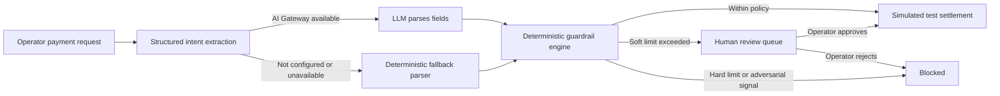

# Sentinel Pay

**A safety control plane for agent-initiated payments.** Sentinel Pay turns a natural-language payment request into a structured intent, evaluates that intent with deterministic guardrails, and routes the result to simulated settlement, human review, or a block.

> **Demo boundary:** this project does not connect to Razorpay APIs and does not move money. Order IDs, payment IDs, signatures, approvals, and settlements are generated by the local simulator. This is an independent prototype and is not affiliated with or endorsed by Razorpay.

**[Open the live demo](https://sentinal-pay-taupe.vercel.app/)** · **[Launch the operator console](https://sentinal-pay-taupe.vercel.app/console)**

## Why this exists

An AI agent can misunderstand a request, repeat a tool call, or encounter adversarial instructions in the content it reads. A model prompt alone is not a reliable way to enforce financial policy. Sentinel Pay places explicit, deterministic controls between intent extraction and payment execution. The model can interpret a request; it cannot set policy or approve a payment.

## Try it

1. Open the [operator console](https://sentinal-pay-taupe.vercel.app/console).
2. Run **Safe payment** to see an automatically approved simulated settlement.
3. Run **Human review** and approve or reject it in the review queue.
4. Run **Adversarial request** to see the policy engine block an unsafe request.
5. Run **Velocity burst** to see the rolling request limit stop the burst.
6. Expand **Decision trace** on a request to inspect intent provenance, extracted fields, each policy check, and the final outcome.

See [docs/DEMO_WALKTHROUGH.md](docs/DEMO_WALKTHROUGH.md) for a short presentation script.

## Decision flow



### What the AI does

For free-form payment instructions, the `/api/chat` handler uses the Vercel AI SDK and AI Gateway for schema-constrained extraction of amount, recipient, category, and urgency. The original request remains the payment reason so the deterministic adversarial checks still see the unmodified text. The model is never given a payment-execution tool. After parsing, the existing `executeAgentPayment` pipeline runs the same guardrail evaluator and mock settlement functions used by the scenario presets. The console labels each free-form request as AI parsed or fallback parsed and shows the model name when available. Preset scenarios provide explicit parameters and skip the model call to keep their expected outcomes reproducible.

If model access is missing, times out, or fails to return valid structured data, the route uses the existing deterministic parser and says so in the decision trace. This fallback keeps the four demo scenarios usable; it is not evidence of LLM execution.

### Deterministic controls

The existing policy engine in `lib/guardrails.ts` checks adversarial instructions, recipient risk, transaction amount, rolling spend, and request velocity. Current demo defaults include:

| Policy | Demo setting | Result |
| --- | ---: | --- |
| Autonomous single-payment limit | ₹10,000 | Higher amounts enter operator review |
| Hard single-payment limit | ₹50,000 | Higher amounts are blocked |
| Rolling one-hour budget | ₹75,000 | Exceeding the budget is blocked |
| Payment velocity | 3 requests per minute | Excess requests are blocked |

These settings are illustrative demo defaults, not a production risk policy.

## Project structure

```text
app/
  api/chat/route.ts       Intent extraction and entry to payment execution
  api/guardrails/route.ts Guardrail configuration and velocity metrics
  api/payments/route.ts   Ledger reads and operator review/reset actions
  console/page.tsx        Operator-console route
  page.tsx                Product landing page
components/console/       Interactive operations workspace
lib/guardrails.ts         Deterministic policy evaluation and counters
lib/razorpay.ts           Simulated order/capture/signature helpers
lib/store.ts              In-memory transaction and review ledger
lib/types.ts              Shared payment and guardrail types
docs/DEMO_WALKTHROUGH.md  Suggested evaluator walkthrough
```

## Run locally

Requirements: Node.js 22+ and npm.

```bash
npm install
cp .env.example .env.local
npm run dev
```

Open [http://localhost:3000](http://localhost:3000). To use model-backed extraction locally, set `AI_GATEWAY_API_KEY` in `.env.local`. You can choose a supported model with `AI_MODEL`; the default is `openai/gpt-4o-mini`. Without an AI Gateway credential, the app uses and labels the fallback parser.

## Deployment notes

- The hosted URL is a demonstration of the current branch, not a live Razorpay integration. Deployments update only after the repository is pushed and the hosting provider builds the new revision.
- On Vercel, enable AI Gateway for the project to use deployment OIDC, or set `AI_GATEWAY_API_KEY` as a server-only environment variable. Set `AI_MODEL` if you want a different supported model. Redeploy after changing environment variables.
- Never prefix gateway credentials with `NEXT_PUBLIC_`. Do not add Razorpay API keys: the current code does not use them.
- The demo ledger and velocity counters are held in process memory. They may reset or diverge between serverless instances and are not durable or globally consistent.
- Operator actions and reset endpoints currently have no authentication. Keep this prototype and its public demo data-free; it is not suitable for production payments or confidential financial data.

## Existing verification command

`npm run test:guardrails` runs the repository's deterministic guardrail scenario assertions. `npm run lint` and `npm run build` are also available.
